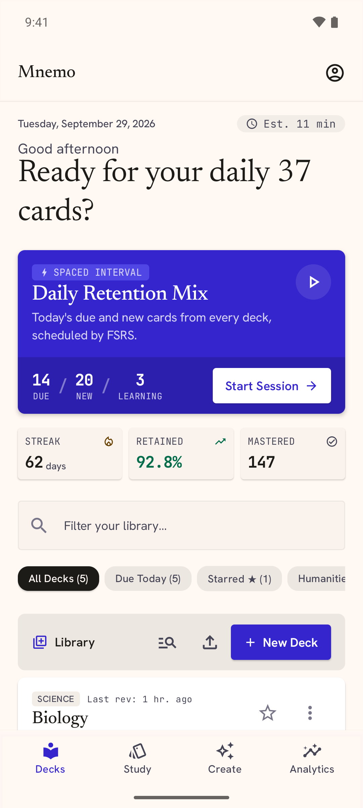
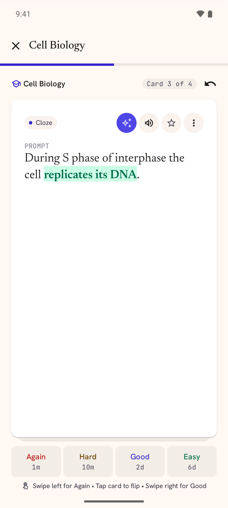
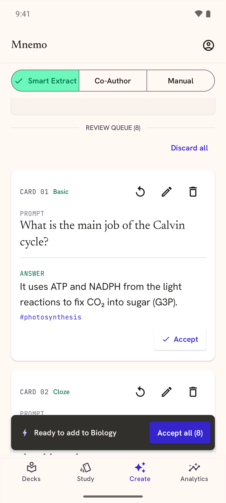
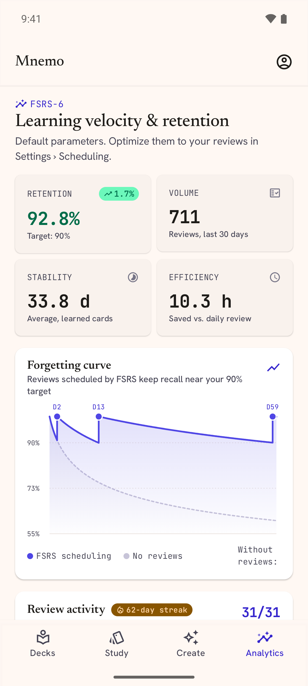

<p align="center">
  
</p>

<h1 align="center">Mnemo</h1>

<p align="center">
  A modern, local-first spaced-repetition app for Android, with optional AI card creation through
  any OpenAI-compatible provider.
</p>

<p align="center">
  <a href="https://yahyafati.github.io/mnemo/"><b>Download</b></a> for Android, Windows, macOS and Linux
</p>

<p align="center">
  
  
  
  
</p>

Mnemo keeps what works about Anki (spaced repetition, decks, `.apkg` compatibility) and changes
three things:

- **Modern look and feel.** Material 3, gestures, motion and clear stats.
- **Local first.** Your cards, review history and settings live on the device. Everything works
  offline, with no account. Nothing leaves the phone unless you ask it to.
- **Bring your own AI.** Card generation and study help work with the provider you configure:
  OpenAI, OpenRouter, Groq, DeepSeek, Mistral, Gemini, or a self-hosted Ollama or LM Studio. AI is
  never required.

## Features

- **Study with FSRS-6.** A pure-Kotlin port of py-fsrs 6, with undo, and an on-device optimizer
  that fits the algorithm to your own review history.
- **Card types.** Basic, Basic + Reversed, Cloze, Type-in and Multiple choice, with Markdown,
  images, LaTeX math (KaTeX), code, audio, text-to-speech and hints.
- **Decks.** Nested `Parent::Child` decks, tags, exam countdowns, a card browser and a
  home-screen widget.
- **Anki interop.** Import and export `.apkg` / `.colpkg` with review history and media.
- **Your data stays yours.** Backup and restore, plus a full JSON export. API keys are encrypted on
  the device and are never included in backups or exports.
- **Smart Extract.** Turn pasted notes, PDFs, links or dictation into a review queue of cards.
  Nothing is saved until you accept it.
- **Study-time AI.** Explain, Example and Rewrite on a card, and Co-Author for suggesting missing
  cards, finding duplicates and fixing weak ones.
- **Analytics.** True retention, forgetting curve, activity calendar, deck maturity, forecast and
  hardest cards, all computed locally.
- **No tracking.** No analytics or telemetry SDKs and no proprietary Google libraries.

## Status

Phases 0–6 of the [roadmap](docs/ROADMAP.md) are implemented, and the project is working towards
v1.0 on Google Play and F-Droid (see the [release roadmap](docs/release/ROADMAP.md)). A few manual
checks on real devices and providers are still open.

## Building

Requirements: Android Studio (or the Android SDK command-line tools) and a JDK 21 to run Gradle.
The JDK 25 toolchain that the unit tests use is downloaded by Gradle on first build.

```bash
./gradlew assembleDebug testDebugUnitTest lint   # the exit check CI runs
./gradlew installDebug                           # install on a connected device or emulator
./gradlew assembleRelease                        # R8-minified; unsigned without a keystore
```

The desktop app (Windows, macOS, Linux; in progress, see [docs/desktop/ROADMAP.md](docs/desktop/ROADMAP.md))
runs with `./gradlew :desktop:run`. Its installers come from GitHub Releases, and
[docs/desktop/install.md](docs/desktop/install.md) covers installing, updating, uninstalling and where the data
lives. To build one yourself, on the system it is for (JDK 21 to run Gradle):

```bash
./gradlew :desktop:packageDmg    # macOS; :desktop:packageMsi on Windows, :desktop:packageDeb / :desktop:packageRpm on Linux
```

The JVM-only modules use `test` instead of `testDebugUnitTest`:

```bash
./gradlew :core:ai:test :core:anki:test :core:model:test :core:scheduler:test :core:common:test :core:sync:test
```

Release signing is optional and described in [docs/release/signing.md](docs/release/signing.md).
Never commit a keystore or its passwords.

## Project layout

Mnemo is a multi-module Kotlin project (Jetpack Compose, Room, Koin, WorkManager) following the
official Android UI → Domain → Data layering.

| Path | What it holds |
|---|---|
| `app/` | The application shell, navigation, widget and onboarding |
| `desktop/` | The desktop launcher (Windows, macOS, Linux), in progress |
| `feature/` | One module per feature: `analytics`, `browse`, `create`, `decks`, `settings`, `study` |
| `core/` | Shared modules: `ai`, `anki`, `common`, `data`, `database`, `datastore`, `designsystem`, `domain`, `ingest`, `model`, `scheduler`, `security`, `testing`, `ui` |
| `build-logic/` | Convention plugins that hold all shared Gradle configuration |
| `docs/` | Product, architecture, roadmap, decision records (ADRs), design mockups and release docs |

Feature modules never depend on each other; they navigate through routes in `:core:ui`. For the
full picture read:

- [docs/PROJECT_OVERVIEW.md](docs/PROJECT_OVERVIEW.md): what the product is and why
- [docs/ARCHITECTURE.md](docs/ARCHITECTURE.md): modules, layers and rules
- [docs/ROADMAP.md](docs/ROADMAP.md): the phases
- [docs/adr/](docs/adr/): the decisions behind the design

## Privacy

Mnemo has no account and no telemetry. When you configure an AI provider, only the text needed for
the request goes to that provider, and the app tells you what will be sent before the first
request. See the [privacy policy](docs/release/privacy-policy.md).

## Contributing

Contributions are welcome. See [CONTRIBUTING.md](CONTRIBUTING.md) for how to report bugs, propose
changes and open a pull request.

## License

Mnemo is free software under the [GPL-3.0-or-later](LICENSE). Third-party components and their
notices are listed in [NOTICE](NOTICE).
